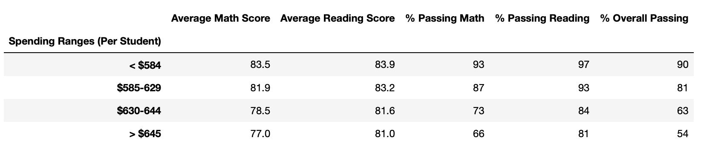
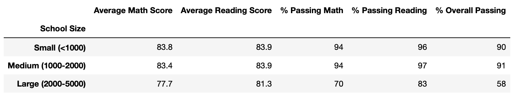
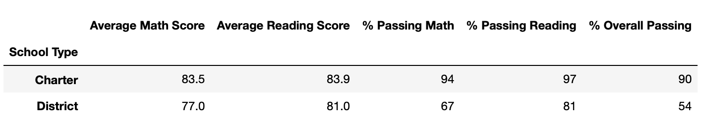

# PyCity Schools with Pandas

## Overview
We have been notified by the school board that the <code>students_complete.csv</code> file shows evidence of academic dishonesty; specifically, reading and math grades for Thomas High School ninth graders appear to have been altered. Although the school board does not know the full extent of the academic dishonesty, they want to uphold state-testing standards. We have been asked to replace the math and reading scores for Thomas High School with **NaNs** while keeping the rest of the data intact.

With the suspicious math and reading scores removed from the district calculations, presented here is the updated school district analysis report.

### Results:
The updated School District Summary displaying average math and reading scores and percentages passing for the district as a whole:  
  
*Thomas High School (THS) data has been purged of 9th grade math and reading results.*

- Math and reading test averages per school and per grade level:  
  
*Notice that the 9th Grade results for THS are marked nan (not a number). These results are not reflected in any of the data presented, and the number of these freshmen have been deducted from all calculation based on student body count of any kind.*

- The top 5 performing schools by overall passing percentage are:  

*Thomas High School is a high performing school without including the 9th graders results.*

- The bottom 5 performing schools by overall passing percentage are:  

- Score Averages by Budget per Student  
  

- Score Averages by School Size  
  

- Score Averages by School Type  
  

## Summary:

This data shows trends in the following areas:
* Teachers with higher budgets per student did not yeild higher overall test passing percentages.
* Large schools (of 2000-5000 students) underperformed vs. small and medium sized schools by about 50%.
* Charter schools are outperforming District schools by about 50% in overall passing percentage.
* ***Of the top 5 performing schools, all are Charter schools.***
* ***Of the bottom 5 performing schools, all are District schools***
